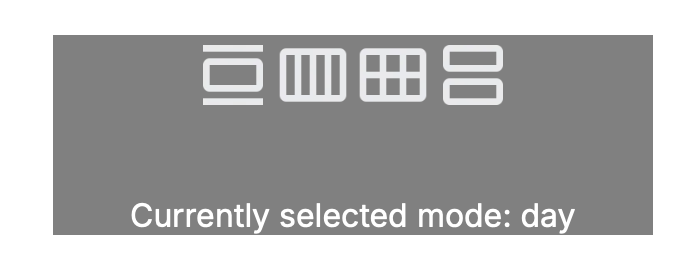

# Exercise 1 - Simple unit testing

## Setup

- Checkout the repo and switch to the `exercise-1-creating-simple-tests` branch
- Run `npm i` to install all the dependencies
- Run `npm run dev` to see the project

## Exercise description

Most calendar apps have different views such as a one day, three day and agenda view. I have created a component called `calendar-switcher`. The component looks like this:

The component is quite simple - there are no props and it renders out 4 icons and some text.

Before you start writing any code, you need to understand how the component works. Inspect the code and become comfortable with it. Try to answer the following questions, these will be useful later on:

- What is the behaviour of the component when the page renders?
- What happens when you click on an icon?
- What are the possible modes the calendar can be in?

Once you are happy you can answer these questions, you csn begin writing the unit tests needed to confirm this component is working correctly.

Create a folder `__tests__` inside `src/components/calender-switcher` and inside the `__tests__` folder, create a file called `calendar-switcher.test.tsx`.

Now you can begin writing tests that cover the behaviour you investigated earlier. The aim is to mske sure you write enough tests to cover all the things you can do with the component.

You can run `npm run test` at any point to see if your tests are passing or not.
